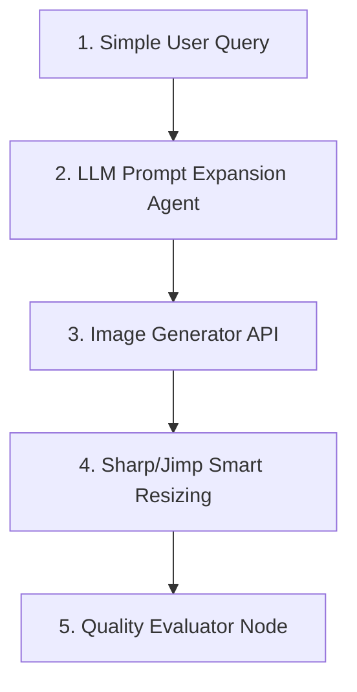

# API 기반 이미지 생성 고도화 및 프롬프트 확장 디자인 가이드라인

웹 브라우저의 이미지 생성 UI(예: Gemini Web, ChatGPT Plus 등)와 비교했을 때, 로컬 API(Gemini API, DALL-E API 등)를 사용해 생성한 이미지의 퀄리티가 떨어지거나 스타일 일관성이 유지되지 않는 문제를 해결하기 위한 디자이너 가이드라인입니다.

---

## 1. 퀄리티 격차의 핵심 원인

### ① 백그라운드 프롬프트 확장(Prompt Expansion) 레이어의 부재
* **웹 UI**: 사용자가 입력한 짧고 단순한 지시어(예: `"DevOps 엔지니어 캐릭터"`)를 시스템 프롬프트 및 LLM 보강 엔진이 감지하여, 화풍(Style), 구도(Composition), 조명(Lighting), 디테일(Fine details), 카메라 렌즈 설정 등의 "Aesthetic Modifier(심미적 수식어)"를 자동으로 덧붙여 이미지 모델에 전달합니다.
* **로컬 API**: 중간 보강 과정 없이 전달된 텍스트 그대로 생성하므로, 구체적인 시각 조건이 명시되지 않으면 모델이 무작위의 평이하거나 완성도 낮은 스타일을 출력합니다.

### ② 컨텍스트 및 스타일 레퍼런스(Style Reference) 가중치 손실
* API 호출 시 레퍼런스 이미지를 프롬프트에 직접 매칭할 때, 웹 인터페이스처럼 정교하게 튜닝된 멀티모달 가중치(Style Transfer Weight)를 그대로 활용하기 어렵습니다. 따라서 이전 봇들의 화풍(예: 2D 플랫 일러스트, 굵은 외곽선)과의 일관성이 저하됩니다.

### ③ 이미지 가공(Post-processing) 단계의 보간 품질 저하
* 생성된 원본 포맷(주로 JPG)을 크기 조정하거나 투명도(Alpha Channel)가 포함된 PNG로 변환하는 과정에서, 보간법(Interpolation) 알고리즘이 올바르지 않으면 픽셀이 깨지거나 안티앨리어싱이 뭉개지는 현상이 발생합니다.

---

## 2. API 프롬프트 엔지니어링 프레임워크 (디자인 관점)

API 환경에서 웹 UI 이상의 고품질 디자인을 확보하기 위해, 프롬프트를 **[CLEAR + XML] 구조화 패턴**으로 작성합니다.

```
<image_generation_prompt>
  <subject>[주체] 성별, 인상, 표정, 의상(컬러 코드), 고유 디테일</subject>
  <composition>[구도 및 샷] 클로즈업, 정면, 아이레벨, 대칭형 레이아웃</composition>
  <style>[스타일 및 화풍] 2D vector flat illustration, clean outlines, solid cell shading, anime style</style>
  <color_palette>[색상 체계] Main color: Emerald Green (#10B981), Soft light grey background (#F3F4F6)</color_palette>
  <lighting>[조명 및 렌더링] Studio lighting, soft diffuse shadows, high-contrast, clean renders</lighting>
  <avoid_modifiers>[금지 요소] 3D render, photorealistic, gradient, robotic parts, mechanical armor, cyborg</avoid_modifiers>
</image_generation_prompt>
```

### 필수 디자인 수식어 (Aesthetic Modifiers) 풀
API 이미지 생성 요청 시, 아래의 수식어 세트를 목적에 맞게 인젝션(Injection)합니다.

| 분류 | 키워드 추천 (2D 일러스트/캐릭터 기준) |
| :--- | :--- |
| **선화/라인** | `clean line art`, `sharp contours`, `minimalist vector lines`, `bold outlines` |
| **채색 기법** | `solid cell shading`, `flat coloring`, `two-tone vector style`, `no smooth gradients` |
| **렌더 스타일**| `2D flat illustration`, `vector graphic`, `webtoon style`, `modern UI character asset` |
| **빛과 그림자**| `ambient occlusion`, `soft diffuse lighting`, `studio lighting`, `flat shadows` |

---

## 3. 에이전트 이미지 퀄리티 파이프라인 제안

로컬 환경에서 수동 생성을 자동화하고 품질을 모니터링하기 위해 아래의 **3단계 파이프라인**을 적용합니다.



1. **LLM 기반 프롬프트 확장 레이어 구동**
   * 사용자 쿼리를 이미지 생성 모델로 직접 보내기 전, LLM(예: Gemini 1.5 Flash/Pro)을 경유시킵니다.
   * "사용자의 입력을 2D 웹툰 스타일 아바타를 위한 고품질 CLEAR 포맷 프롬프트로 확장하라"는 메타 프롬프트를 실행합니다.
2. **다운스트림 변환 최적화 (Post-processing)**
   * JPG -> PNG 변환 및 리사이징(예: `Jimp`, `Sharp` 라이브러리 사용 시) 시 **Lanczos** 혹은 **Bicubic** 보간 필터를 강제 지정하여 테두리 픽셀이 계단식으로 깨지는 현상을 방지합니다.
   * 투명 배경 추출 시, 배경 색상 경계면에 발생하는 안티앨리어싱 매트(Matte)를 제거하는 블렌딩 기술을 적용합니다.
3. **디자이너 가이드 평가(Evaluator) 단계**
   * 최종 이미지를 UI/UX 관점에서 검증(색상 대비, ARIA 타겟 적절성, 스타일 통일성 확인)하여 통과한 에셋만 빌드에 포함시킵니다.
